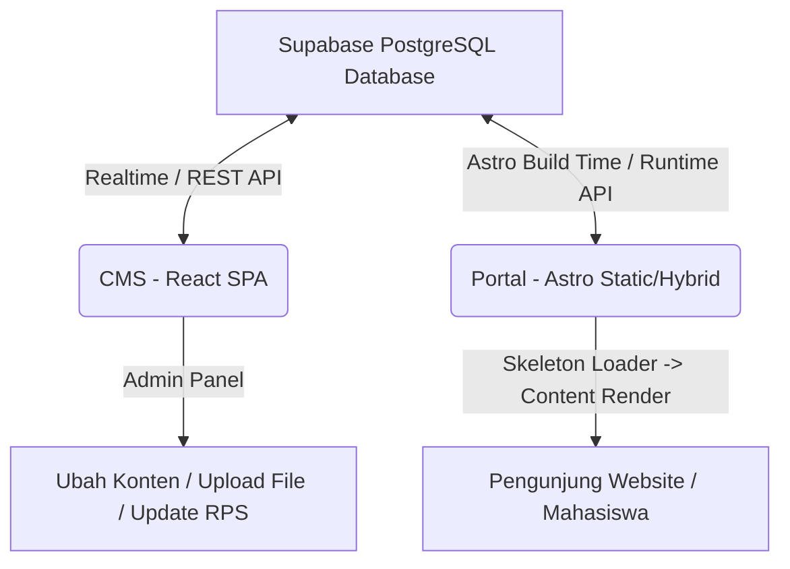

# Dokumen Teknis & Panduan Pengembangan Mandiri

Dokumen ini berisi dokumentasi lengkap mengenai arsitektur kode, struktur desain UI/UX, spesifikasi teknis fitur baru (RPS & Tujuan Pendidikan dinamis), serta peta jalan pengembangan masa depan (Future Development Roadmap) untuk sistem portal akademik program studi Universitas Muhammadiyah Bandung.

---

## 1. Arsitektur Sistem & Aliran Data (Data Flow)

Sistem ini dirancang menggunakan arsitektur **Decoupled Monorepo** yang memisahkan antara bagian pengelolaan data (CMS) dan bagian penyajian konten ke publik (Portal Akademik).



### 1.1 Repositori Terlibat
1. **`cms-prodi` (React + Vite + Tailwind)**: Aplikasi Single Page Application (SPA) khusus admin untuk memperbarui data perkuliahan, profil dosen, pengumuman, statistik, dan konfigurasi umum situs.
2. **`prodi-umbandung` (Astro + React + Tailwind)**: Portal utama publik yang dioptimalkan untuk kecepatan akses (SEO & Performance) menggunakan static site generation (SSG) dengan hidrasi parsial (React Island Architecture) untuk area interaktif.

### 1.2 Sinkronisasi Data Halaman Depan
* **Supabase Client**: Menggunakan query tersentralisasi di `src/lib/supabase/db.ts` dan client instance di `client.ts`.
* **State Loading**: Setiap komponen interaktif menggunakan custom hooks (`src/hooks/useSupabaseData.ts`) yang mengembalikan status `loading`, `error`, dan `data`.
* **Mekanisme Fallback**: Jika koneksi ke Supabase belum terkonfigurasi (`isSupabaseConfigured` bernilai false), sistem akan beralih menggunakan *hardcoded fallback data* secara instan tanpa merusak UI.

---

## 2. Struktur Kode Detail (Code Structure)

### 2.1 Repositori Portal (`prodi-umbandung`)
Struktur berkas utama:
```
prodi-umbandung/
├── src/
│   ├── components/      # Komponen UI global (seperti StaggerTestimonials, dll)
│   ├── config/          # prodi.config.ts (Konfigurasi branding statis prodi)
│   ├── hooks/           # useSupabaseData.ts (Custom React Hooks untuk fetching)
│   ├── layouts/         # Layout halaman Astro (Layout.astro, KurikulumPageLayout.astro)
│   ├── lib/
│   │   └── supabase/    # client.ts (koneksi) & db.ts (query query database)
│   ├── pages/           # Routing Astro (index.astro, kurikulum.astro, dll)
│   └── sections/        # Section modular beranda (HeroSection.tsx, SambutanKaprodi.tsx)
```

### 2.2 Repositori CMS (`cms-prodi`)
Struktur berkas utama:
```
cms-prodi/
├── src/
│   ├── components/
│   │   ├── Modals/      # CrudModal.tsx (Form edit data termasuk RPS URL)
│   │   ├── Tabs/        # SiteContentTab.tsx, CoursesTab.tsx, dll
│   │   ├── Sidebar.tsx
│   │   └── Header.tsx
│   ├── lib/
│   │   ├── cmsLabels.ts # Peta translasi kunci database ke label human-readable
│   │   ├── mockData.ts  # Mocking data untuk pengembangan lokal offline
│   │   └── supabase.ts  # Operasi tulis/update data admin
│   └── App.tsx          # Router utama & state management CMS
```

---

## 3. Desain UI/UX & Interaksi (Design System)

### 3.1 Estetika Visual (Visual Aesthetics)
* **Tema**: *Premium Neobrutalism & Mono Design* dengan sentuhan aksen warna terkurasi (`mono-cream`, `mono-yellow`, dan `mono-black`).
* **Batas & Garis**: Penggunaan garis tipis yang tegas (`border-mono-black/10` atau `border-slate-200`) untuk menciptakan kesan minimalis berkelas.
* **Micro-interactions**:
  * **Kaprodi Welcome Section**: Foto Kaprodi ditampilkan penuh warna (grayscale dihapus) dengan transisi hover yang halus untuk memberikan nuansa hangat dan representatif.
  * **Skeleton Loader**: Animasi bayangan berdenyut (`animate-pulse`) yang dibuat menyerupai struktur kolom asli agar mata pengunjung tidak lelah saat menunggu pemuatan data.

### 3.2 Implementasi Skeleton pada Tujuan Pendidikan
Saat data di-fetch dari database, tab menu dan isi konten menampilkan kerangka skeleton:
```typescript
if (loading) {
  return (
    <section id="tujuan-pendidikan" className="w-full py-24 lg:py-32 bg-mono-cream">
      <div className="max-w-7xl mx-auto px-6 lg:px-12 animate-pulse">
        {/* Skeleton Header, Tab Buttons, and Grid Content */}
      </div>
    </section>
  );
}
```

---

## 4. Fitur Spesifik (Spesifikasi Fitur Baru)

### 4.1 Unduh RPS (Rencana Pembelajaran Semester)
* **Database**: Kolom `rps_url` tipe `text` ditambahkan pada tabel `public.kurikulum_courses`.
* **CMS Form**: Input teks field "Tautan Dokumen RPS (Google Drive/URL)" ditambahkan pada formulir mata kuliah di `CrudModal.tsx`.
* **Portal Render**: `KurikulumPageLayout.astro` mendeteksi keberadaan `course.rps_url`. Jika ada, tombol unduh dengan ikon download akan muncul secara dinamis di sebelah detail mata kuliah.

### 4.2 Rencana & Tujuan Akademik Dinamis
* **Sistem Kunci**: Memanfaatkan tabel `site_content` dengan awalan kunci `kurikulum_` agar otomatis terkelompok pada tab **Kurikulum** di panel CMS.
* **Fallback Teknologi Pangan**: Jika database kosong, halaman portal akan menyajikan default PEO/PLO, sarana laboratorium gizi/sensoris/pilot plant pengolahan, dan rencana semester Teknologi Pangan secara otomatis.

---

## 5. Rencana Pengembangan ke Depan (Future Roadmap)

### 5.1 Migrasi Konten Statis Tersisa ke CMS
* **Filosofi Belajar & Video Profil**: Memindahkan video link YouTube dan teks filosofi beranda ke tabel `site_content` agar dapat disesuaikan tanpa menyentuh kode.
* **Tata Kelola Detail**: Memindahkan tautan email dan media sosial dosen agar terhubung penuh ke profil masing-masing.

### 5.2 Optimasi Aksesibilitas & Performa
* **Astro Hybrid Rendering**: Mengaktifkan caching pada level SSR/Edge Network untuk data dinamis yang jarang berubah (seperti daftar mata kuliah), sehingga kecepatan muat situs di bawah 1 detik.
* **PDF Preview Terintegrasi**: Mengembangkan modal pratinjau dokumen RPS langsung di dalam portal tanpa perlu melempar user ke Google Drive.

### 5.3 Rekomendasi Restrukturisasi Menu Navigasi CMS (Alignment dengan Landing Page)
* **Tantangan UI/UX**: Pengelompokan grup menu di sidebar CMS saat ini (Konten Umum, Akademik, Prestasi & Kegiatan, Halaman & Konten) kurang intuitif dan berbeda dari menu website utama. Hal ini membingungkan administrator saat ingin mencari bagian mana yang mengontrol halaman tertentu.
* **Solusi Penyelerasan**: Mengatur ulang kategori navigasi pada komponen `Sidebar.tsx` CMS agar memiliki kesamaan struktur dengan menu utama di website (`Navigation.tsx` portal):
  1. **Beranda / Landing**: Dashboard utama, Galeri Portfolio, Statistik Ribbon, dan pengaturan teks beranda.
  2. **Tentang Kami**: Editor Visi & Misi, Dosen & Staff (SDM), dan Kemitraan Industri.
  3. **Akademik**: Editor Mata Kuliah (Kurikulum), CPL / PLO, Profil Lulusan, Publikasi Dosen, dan Tahapan Tugas Akhir.
  4. **Statistik**: Statistik Mahasiswa Baru (Maba).
  5. **Mahasiswa & Alumni**: Prestasi Mahasiswa, Testimoni Alumni, dan direktori Alumni.
  6. **Galeri Kegiatan**: Berita & Artikel, Agenda Kegiatan, Kegiatan Dosen, dan Kegiatan Mahasiswa.
  7. **Pengaturan**: Setup Database & Akun.
* **Keuntungan**: Administrator dapat langsung mengenali menu pengeditan secara logis berdasarkan apa yang mereka lihat di tampilan website utama.
